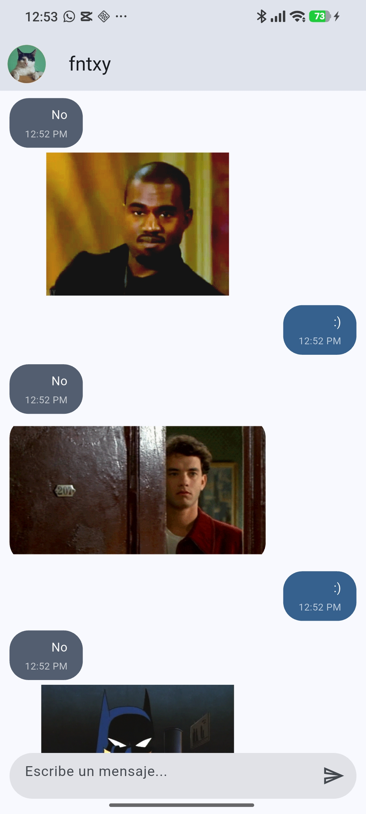
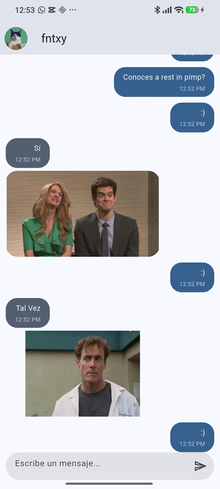
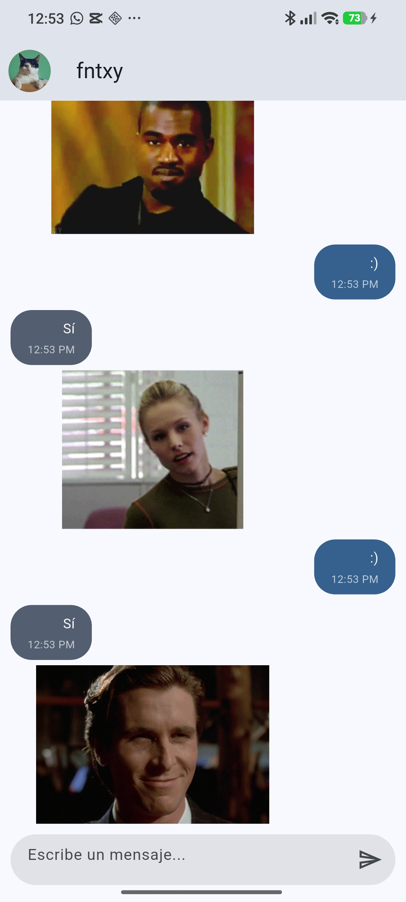
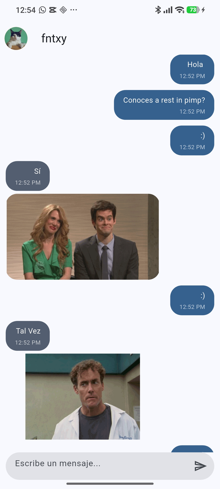

# Práctica 03 - Yes No App

Aplicación Flutter que simula un chat con respuestas aleatorias de tipo sí/no/tal vez, mostrando un mensaje del bot y una imagen GIF relacionada.
## Diagrama de arquitectura

Puedes consultar el diagrama de arquitectura de la aplicación en el siguiente enlace:

[Ver diagrama de arquitectura](https://diegomiguel04.github.io/Practicas_DMI_230260/Practica03/arquitectura/)

## Descripción

Esta app consume la API pública de YesNo WTF para obtener una respuesta aleatoria y luego muestra el resultado en una interfaz tipo chat. El flujo principal es:

1. El usuario escribe un mensaje.
2. La app genera una respuesta automática.
3. Se consulta la API de `yesno.wtf`.
4. Se interpreta la respuesta.
5. Se muestra el texto en el chat junto con un GIF aleatorio o asociado a la respuesta.

## Funcionalidades

- Interfaz tipo chat con mensajes propios y del bot.
- Respuestas aleatorias: `yes`, `no` o `maybe`.
- Consumo de API con `Dio`.
- Manejo de estado con `Provider`.
- Visualización de GIFs desde URL web o assets locales.
- Estructura basada en arquitectura simple por capas.

## Stack tecnológico

- Flutter
- Dart
- Provider
- Dio
- Material Design
- API Yes/No de `yesno.wtf`

## Evidencia visual

Estas capturas muestran el comportamiento de la aplicación en ejecución:

<div align="center">

  

  

</div>

<div align="center">

  

  

</div>

## Estructura del proyecto

```text
lib/

├── config/
│   ├── helpers/
│   └── theme/

├── domain/
│   └── entities/

├── infrastructure/
│   ├── models/
│   └── repositories (si se extiende en el futuro)

├── presentation/
│   ├── providers/
│   ├── screens/
│   └── widgets/

├── main.dart
└── ...