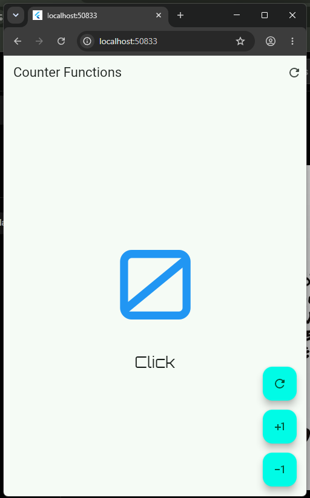
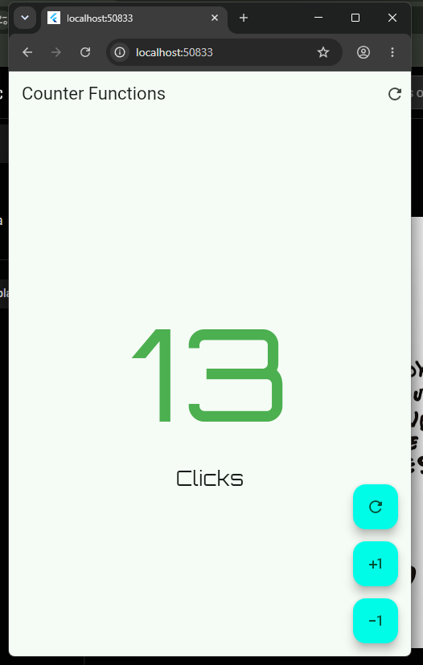
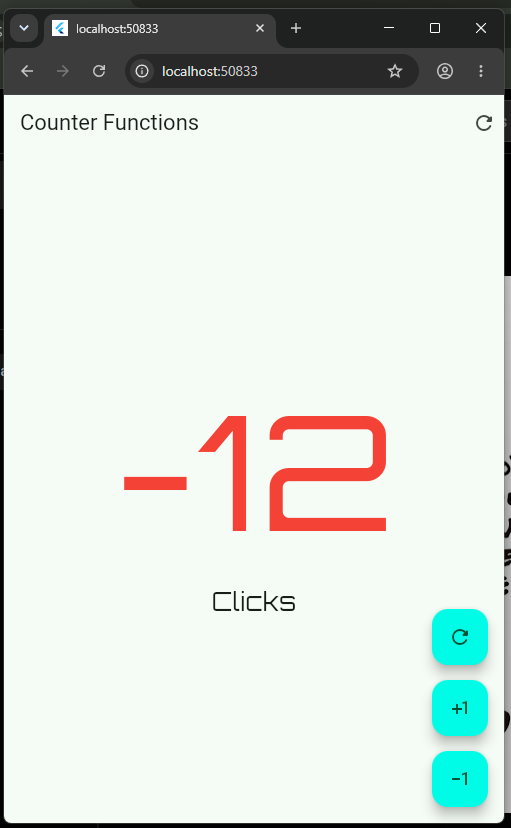
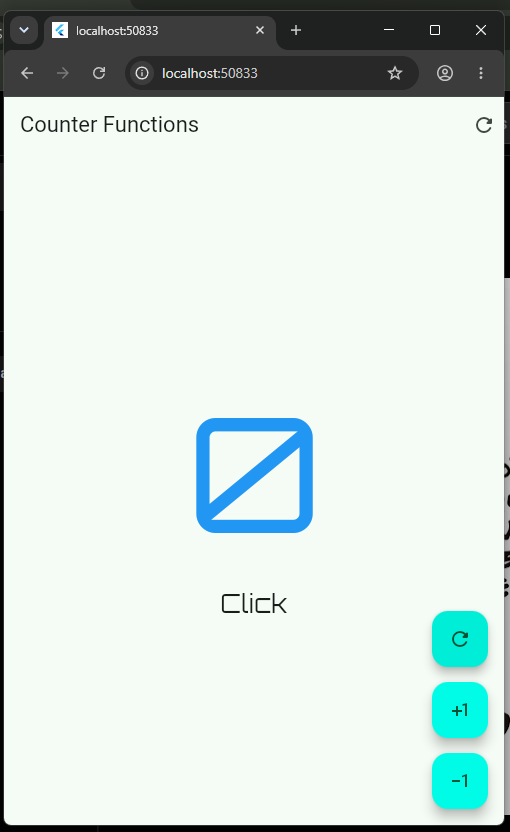

# Hello World App

## Diagrama

- [Enlace al diagrama](https://devfntxy.github.io/diagramweb/)

Este diagrama fue creado con Archify para ofrecer una mejor comprensión del sistema de Flutter, la estructura del proyecto y cómo interactúan sus componentes dentro de la aplicación.

## Descripción

Este proyecto representa una app base de Flutter con una pantalla principal donde el usuario puede:

- incrementar el contador
- reiniciarlo a cero
- disminuir el valor
- observar cambios de color según el estado del número

La aplicación sirve como ejemplo de estructura básica de Flutter, organización por carpetas y manejo de estado con `setState()`.

## Tecnologías

- Flutter
- Dart
- Material Design

## Estructura del proyecto

```text
hello_world_app/
├── android/            # configuración de Android
├── ios/                # configuración de iOS
├── lib/                # código fuente principal
│   ├── main.dart
│   └── presentation/
│       └── screens/
│           └── counter/
│               ├── counter_screen.dart
│               └── counter_functions_screen.dart
├── test/               # pruebas
├── web/                # configuración web
├── windows/            # configuración Windows
├── linux/              # configuración Linux
├── macos/              # configuración macOS
├── analysis_options.yaml
├── pubspec.yaml
├── README.md
└── ...
```

## Requisitos

- Flutter SDK instalado
- Editor compatible: VS Code o Android Studio
- Dispositivo emulador o dispositivo físico

## Instalación y ejecución

1. Clona el proyecto o entra a la carpeta.
2. Asegúrate de tener Flutter instalado y configurado.
3. Ejecuta:

```bash
flutter pub get
flutter run
```

## Funcionalidades principales

- contador con valor inicial en cero
- botones para sumar, restablecer y restar
- cambio de color del número:
  - positivo: verde
  - negativo: rojo
  - cero: azul
- interfaz organizada por componentes y pantallas

## Capturas de la práctica

### Estado inicial (valor en cero)



### Contador en valor positivo



### Contador en valor negativo



### Botón de reinicio



